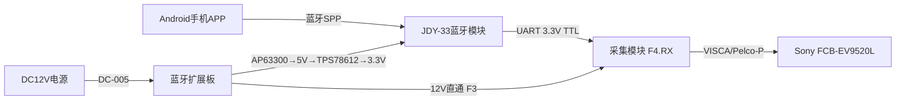
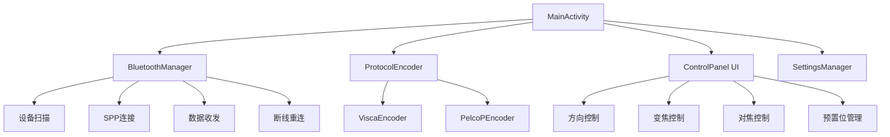
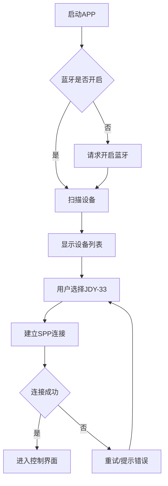
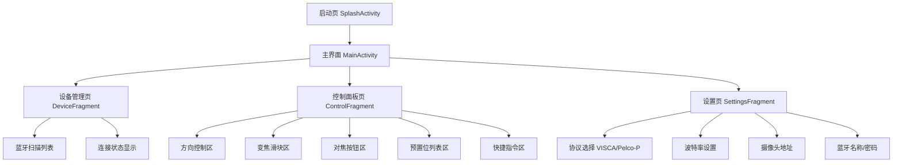

# Sony FCB-EV9520L 蓝牙无线遥控器设计方案

基于 USB TYPE-C 编码采集模块，为 Sony FCB-EV9520L 30倍光学变焦摄像机芯设计的一套蓝牙无线遥控系统。

### [演示地址](https://remote.unitos.cn/) | [源码下载](https://shop.unitos.cn/item/15)

---

## 屏幕

<table width="100%">
<tr>
<td >

</td>
<td>
    
</td>
 </tr>
</table>

## 一、项目概述

### 1.1 项目目标

基于现有 **USB TYPE-C 编码采集模块**，设计一套蓝牙无线遥控系统，实现通过 Android 手机 APP 远程控制 Sony FCB-EV9520L 高清摄像机芯的云台、变焦、对焦等功能。

### 1.2 系统组成

| 组件 | 型号/平台 | 功能 |
|------|-----------|------|
| 摄像机芯 | Sony FCB-EV9520L | 30倍光学变焦高清摄像头 |
| 编码采集模块 | USB TYPE-C采集板 | 视频UVC输出 + VISCA串口控制 |
| 蓝牙扩展板 | 自研（AP63300 + TPS78612 + JDY-33）| 蓝牙透传桥接 |
| Android APP | 自研 | 无线遥控器界面 |

### 1.3 系统架构



### 1.4 数据流向

```
用户触控操作
    ↓
Android APP (VISCA/Pelco-P指令编码)
    ↓
蓝牙SPP发送 (经典蓝牙2.0, 9600bps)
    ↓
JDY-33 蓝牙透传模块 (TXD Pin1)
    ↓
采集模块 F4.Pin6 (RX, 3.3V TTL)
    ↓
内部MCU解析 → VISCA指令 → Sony FCB-EV9520L
    ↓
摄像头执行动作 (变焦/对焦/云台)
```

### 1.5 核心技术指标

| 指标 | 参数 |
|------|------|
| 蓝牙通信距离 | ≥10m（空旷环境可达20m）|
| 指令响应延迟 | ≤100ms（蓝牙透传延迟约20-40ms）|
| 支持协议 | Sony VISCA + Pelco-P |
| 串口波特率 | 9600bps / 8N1 |
| 串口电平 | 3.3V TTL |
| 工作电压 | DC 9-12V / 1A |
| 蓝牙模块功耗 | ~50mA（通信态）|
| PCB尺寸 | 48 × 48 mm |
| 工作温度 | -5°C ~ +60°C |

---

## 二、硬件原理图设计

### 2.1 电源架构

系统采用**两级降压**架构，兼顾效率与噪声：

```
DC12V输入 → D1(SS014保护) → AP63300WU-7(12V→5V, 效率~95%)
                                    ↓
                              TPS78612-33D9(5V→3.3V, 低噪声LDO)
                                    ↓
                              JDY-33蓝牙模块 (3.3V)

DC12V输入 → F3连接器 → 采集模块供电 (12V直通)
```

**设计优势：**
- 第一级开关电源（AP63300）：高效率（~95%），减少发热
- 第二级LDO（TPS78612）：低噪声输出，蓝牙通信更稳定
- 12V直通给采集板：不经过降压，保证采集板供电充足

### 2.2 DC-DC降压电路 — AP63300WU-7

**芯片简介：**
- 输入电压范围：3.8V ~ 32V
- 输出电流：最大3A
- 开关频率：500kHz
- 封装：TSOT-26
- 内置同步整流，无需外部续流二极管

**引脚连接：**

| 引脚 | 名称 | 连接 |
|------|------|------|
| 1 | FB | 反馈分压网络中点 |
| 2 | EN | 使能，通过电阻接VIN（常开）|
| 3 | VIN | 12V输入（经D1保护后）|
| 4 | GND | 接地 |
| 5 | SW | 开关输出 → L1(10μH) |
| 6 | BST | 自举电容（100nF接SW）|

**外围元件：**

| 元件 | 参数 | 作用 |
|------|------|------|
| D1 | SS014 | 输入反接保护二极管 |
| C_BST | 100nF | 自举电容（BST→SW）|
| C_IN | 100nF + 47μF | 输入滤波电容组 |
| L1 | 10μH | 功率电感（SW→VOUT）|
| C5-C8 | 10μF × 2 + 100nF | 输出滤波电容组 |
| R_FB1/R_FB2 | 分压电阻 | 设定输出5V |

**输出电压计算：**

```
Vout = 0.8V × (1 + R_FB1 / R_FB2)

设定 Vout = 5V:
5 = 0.8 × (1 + R_FB1 / R_FB2)
R_FB1 / R_FB2 = 5.25

典型值: R_FB1 = 52.3kΩ, R_FB2 = 10kΩ
```

### 2.3 LDO稳压电路 — TPS78612-33D9

**芯片简介：**
- 输入电压范围：1.8V ~ 5.5V
- 固定输出：3.3V（后缀33表示）
- 最大输出电流：500mA
- 压差：~250mV @ 500mA
- 噪声：~50μVrms
- 封装：SOT-23-5

**引脚连接：**

| 引脚 | 名称 | 连接 |
|------|------|------|
| 1 | IN | 5V输入（AP63300输出）|
| 2 | GND | 接地 |
| 3 | EN | 使能（接VIN常开）|
| 4 | FB | 反馈（固定3.3V版本内部连接）|
| 5 | OUT | 3.3V输出 → JDY-33 VCC |

**外围元件：**

| 元件 | 参数 | 作用 |
|------|------|------|
| C_IN | 10μF + 100nF | 输入滤波 |
| C_OUT | 100μF + 100nF | 输出滤波稳压 |

### 2.4 蓝牙模块电路 — JDY-33

**模块简介：**
- 蓝牙版本：蓝牙2.0 + 3.0 SPP
- 工作电压：3.0V ~ 3.6V
- 工作电流：~50mA
- 透传波特率：支持 1200~1382400bps
- 默认波特率：9600bps
- 通信距离：≥20m（空旷）

**26Pin 引脚使用：**

| 引脚 | 名称 | 连接 | 说明 |
|------|------|------|------|
| 1 | TXD | → F4.Pin6 (RX) | 蓝牙数据发送到摄像头 |
| 2 | RXD | NC（悬空）| 本项目不需要接收回执 |
| 3-11 | GPIO等 | NC | 未使用，放置非连接标识 |
| 12 | VCC | ← 3.3V (TPS78612输出) | 电源正极 |
| 13 | GND | ← GND | 电源负极 |
| 14-26 | GPIO等 | NC | 未使用 |

**JDY-33 AT指令配置（出厂前设置）：**

```
AT+BAUD4          # 设置波特率9600
AT+NAME蓝牙遥控器  # 设置蓝牙名称
AT+PIN1234         # 设置配对密码
AT+ENLOG0          # 关闭上电提示
```

### 2.5 采集板接口

**F3：2Pin 电源接口（Molex 532610271，1.25mm间距）**

| 引脚 | 功能 | 连接 |
|------|------|------|
| 1 | DC12V+ | ← +12V_IN（直通）|
| 2 | GND | ← GND |

**F4：8Pin 控制接口（Molex 532610871，1.25mm间距）**

| 引脚 | 信号名 | 功能 | 扩展板连接 |
|------|--------|------|------------|
| 1 | GND | 地 | ← GND |
| 2 | KN | 放大（Zoom In）| NC（预留）|
| 3 | KF | 缩小（Zoom Out）| NC（预留）|
| 4 | KT | 预留口 | NC |
| 5 | TX | 模块串口发送 | NC（预留）|
| 6 | RX | **模块串口接收** | ← JDY-33.TXD (Pin1) |
| 7 | EN | 串口使能 | ← R3(0Ω) → GND |
| 8 | GND | 地 | ← GND |

### 2.6 信号流向与网络连接表

| 网络名 | 连接点 | 说明 |
|--------|--------|------|
| +12V_IN | DC1.1, DC1.2, D1.A, F3.1 | 12V电源输入 |
| 5V | AP63300.OUT, TPS78612.IN | 中间电压 |
| 3V0 | TPS78612.OUT, JDY-33.VCC(Pin12), F4上拉 | 3.3V供电 |
| GND | 所有GND引脚 | 公共地 |
| SW | AP63300.SW, L1.1 | 开关节点 |
| FB_5V | AP63300.FB, R_FB分压中点 | 5V反馈 |
| CAM_RX | JDY-33.TXD(Pin1), F4.Pin6(RX) | 控制信号 |
| EN | F4.Pin7, R3 → GND | 使能接地 |

### 2.7 BOM清单

| 序号 | 编号 | 元件 | 参数 | 封装 | 数量 | 立创商城编号 | 备注 |
|------|------|------|------|------|------|--------------|------|
| 1 | U1 | AP63300WU-7 | DC-DC降压 | TSOT-26 | 1 | 搜索AP63300 | 同步降压 |
| 2 | U6 | TPS78612-33D9 | LDO 3.3V | SOT-23-5 | 1 | 搜索TPS786 | 低噪声 |
| 3 | U2 | JDY-33 | 蓝牙透传 | SMD-26P | 1 | 搜索JDY-33 | SPP模式 |
| 4 | DC1 | DC-005-A200 | DC电源座 | 直插 | 1 | C381116 | 12V输入 |
| 5 | D1 | SS014 | 肖特基二极管 | SMA | 1 | 搜索SS014 | 反接保护 |
| 6 | L1 | 10μH | 功率电感 | 贴片 | 1 | 搜索10uH功率电感 | AP63300配套 |
| 7 | C1 | 100nF | 陶瓷电容 | 0603 | 1 | C14663 | 输入滤波 |
| 8 | C2 | 100nF | 陶瓷电容 | 0603 | 1 | C14663 | BST电容 |
| 9 | C3 | 47μF | 电解电容 | 直插 | 1 | C43823 | 输入大电容 |
| 10 | C5-C6 | 10μF | 陶瓷电容 | 0805 | 2 | 搜索10uF 0805 | AP63300输出 |
| 11 | C7-C8 | 10μF/100nF | 电容 | 0805/0603 | 2 | - | TPS78612输入 |
| 12 | C9-C10 | 100μF/100nF | 电容 | 直插/0603 | 2 | - | TPS78612输出 |
| 13 | R1 | 100kΩ | 电阻 | 0603 | 1 | C25803 | EN上拉 |
| 14 | R3 | 8kΩ | 电阻 | 0603 | 1 | - | 信号调理 |
| 15 | R4 | 1kΩ | 电阻 | 0603 | 1 | C21190 | 信号调理 |
| 16 | R2 | 0Ω | 电阻 | 0603 | 1 | C21189 | EN接地 |
| 17 | R_FB1 | 52.3kΩ | 电阻 | 0603 | 1 | - | FB上拉 |
| 18 | R_FB2 | 10kΩ | 电阻 | 0603 | 1 | C25804 | FB下拉 |
| 19 | CN1(F3) | Molex 2P | 连接器 | 1.25mm | 1 | C225114 | 电源接口 |
| 20 | CN2(F4) | Molex 8P | 连接器 | 1.25mm | 1 | C225118 | 控制接口 |

---

## 三、PCB设计

### 3.1 PCB规格

| 参数 | 规格 |
|------|------|
| 板子尺寸 | 48 × 48 mm（1890 × 1890 mil）|
| 层数 | 2层（顶层+底层）|
| 板厚 | 1.6mm |
| 铜厚 | 1oz (35μm) |
| 最小线宽/线距 | 6mil / 6mil |
| 最小过孔 | 0.3mm孔径 / 0.6mm焊盘 |
| 表面处理 | HASL（有铅喷锡）或 ENIG（沉金）|
| 阻焊颜色 | 绿色 |
| 丝印颜色 | 白色 |

### 3.2 布局原则

```
┌─────────────────────────────────┐
│ [DC1]  [D1] [U1-AP63300] [L1]  │  ← 电源区（左侧/下方）
│        [C_IN]  [C_OUT]         │
│                                 │
│  [F3]        [U6-TPS78612]     │  ← LDO区（中部）
│              [C_LDO]           │
│                                 │
│  [F4]     [R3][R4]             │  ← 接口区（左侧）
│                                 │
│         [U2 - JDY-33]          │  ← 蓝牙区（右侧/上方）
│         ████████████           │
│         █ 天线区域 █ ← 禁止铺铜 │
│         ████████████           │
│ [M2] ──────────────────── [M2] │  ← 安装孔
│ [M2] ──────────────────── [M2] │
└─────────────────────────────────┘
```

**关键布局规则：**
1. AP63300、L1、输入/输出电容紧密放置，减小环路面积
2. TPS78612靠近JDY-33放置，缩短3.3V走线
3. JDY-33天线区域（模块顶部）周围2mm内禁止铺铜
4. F3/F4连接器放在板边，方便接线
5. 电源区与信号区物理分离

### 3.3 布线规范

| 网络类型 | 线宽 | 备注 |
|----------|------|------|
| 12V电源 | ≥0.5mm (20mil) | 大电流路径 |
| 5V电源 | ≥0.4mm (16mil) | AP63300输出 |
| 3.3V电源 | ≥0.3mm (12mil) | LDO输出 |
| GND | 铺铜平面 | 顶层/底层均铺铜 |
| 信号线（CAM_RX等）| ≥0.25mm (10mil) | 普通信号 |
| SW开关节点 | ≥0.5mm (20mil) | 高频大电流 |

**铺铜设计：**
- 顶层：GND铺铜（JDY-33天线区域挖空）
- 底层：GND铺铜（完整覆盖）
- 过孔缝合：铺铜区域每5mm放置GND过孔

### 3.4 安装孔与机械尺寸

```
    2mm    44mm    2mm
  ←───→←────────→←───→
  ┌──○──────────────○──┐  ↑ 2mm
  │                    │
  │   PCB有效区域      │  44mm
  │                    │
  │                    │
  └──○──────────────○──┘  ↓ 2mm
```

- 安装孔：M2（孔径2.2mm，焊盘4mm）
- 安装孔距板边：2mm
- 安装孔网络：GND（接地螺柱可提供屏蔽）

### 3.5 丝印设计

**CN1 (F3电源) 丝印标记：**
```
  12V  GND
  ┌──┬──┐
  │ 1│ 2│  CN1
  └──┴──┘
```

**CN2 (F4控制) 丝印标记：**
```
  GND KN KF KT TX RX EN GND
  ┌──┬──┬──┬──┬──┬──┬──┬──┐
  │ 1│ 2│ 3│ 4│ 5│ 6│ 7│ 8│  CN2
  └──┴──┴──┴──┴──┴──┴──┴──┘
```

### 3.6 DRC检查清单

| 检查项 | 要求 | 通过条件 |
|--------|------|----------|
| 最小线宽 | ≥6mil | 无违规 |
| 最小线距 | ≥6mil | 无违规 |
| 最小过孔 | ≥0.3mm | 无违规 |
| 焊盘间距 | ≥0.2mm | 无违规 |
| 未连接网络 | 0 | 所有飞线消除 |
| 短路 | 0 | 无短路错误 |
| 板框完整性 | BoardOutLine封闭 | 可识别板框 |
| 铜到板边距离 | ≥0.3mm | 防止铜皮外露 |

### 3.7 生产文件输出

**嘉立创EDA导出流程：**
1. 菜单：**制造 → Gerber导出** → 导出全部层
2. 菜单：**制造 → 钻孔文件导出**
3. 菜单：**制造 → BOM导出**
4. 菜单：**制造 → 坐标文件导出**（SMT贴片用）

**一键下单：**
```
菜单：制造 → 嘉立创下单 → 自动上传Gerber → 选择工艺参数 → 提交订单
```

---

## 四、通信协议

### 4.1 Sony VISCA 协议详解

VISCA (Video System Control Architecture) 是 Sony 开发的摄像机控制协议。

**4.1.1 帧格式**

```
发送帧: [Header] [QQ] [RR] ... [FF]
         │        │              │
         │        │              └── 结束符 0xFF
         │        └── 指令内容
         └── 0x81 (地址1控制器→地址1摄像头)

应答帧: [Header] [类型] ... [FF]
         │        │
         │        └── 0x41=ACK, 0x51=完成, 0x61=错误
         └── 0x90 (地址1摄像头→地址1控制器)
```

**4.1.2 常用VISCA指令表**

| 功能 | 指令（HEX） | 说明 |
|------|-------------|------|
| **电源开** | `81 01 04 00 02 FF` | Power On |
| **电源关** | `81 01 04 00 03 FF` | Power Off |
| **变焦Tele（放大）** | `81 01 04 07 02 FF` | Zoom In (标准速度) |
| **变焦Wide（缩小）** | `81 01 04 07 03 FF` | Zoom Out (标准速度) |
| **变焦停止** | `81 01 04 07 00 FF` | Zoom Stop |
| **变焦速度控制（放大）** | `81 01 04 07 2p FF` | p=0~7速度 |
| **变焦速度控制（缩小）** | `81 01 04 07 3p FF` | p=0~7速度 |
| **变焦直接定位** | `81 01 04 47 0p 0q 0r 0s FF` | pqrs=0000~4000 |
| **对焦远** | `81 01 04 08 02 FF` | Focus Far |
| **对焦近** | `81 01 04 08 03 FF` | Focus Near |
| **对焦停止** | `81 01 04 08 00 FF` | Focus Stop |
| **自动对焦开** | `81 01 04 38 02 FF` | Auto Focus On |
| **自动对焦关** | `81 01 04 38 03 FF` | Manual Focus |
| **自动对焦切换** | `81 01 04 38 10 FF` | AF Toggle |
| **预置位设置** | `81 01 04 3F 01 pp FF` | 保存预置位pp (0x00~0xFF) |
| **预置位调用** | `81 01 04 3F 02 pp FF` | 调用预置位pp |
| **预置位清除** | `81 01 04 3F 00 pp FF` | 清除预置位pp |
| **地址设置** | `88 30 01 FF` | 广播地址设定 |
| **IF_Clear** | `81 01 00 01 FF` | 清除命令缓冲 |

**4.1.3 应答帧解析**

| 应答类型 | 格式 | 含义 |
|----------|------|------|
| ACK | `90 41 FF` | 指令已接收，正在执行 |
| Completion | `90 51 FF` | 指令执行完成 |
| Error | `90 61 01 FF` | 消息长度错误 |
| Error | `90 61 02 FF` | 语法错误 |
| Error | `90 61 03 FF` | 命令缓冲满 |
| Error | `90 61 04 FF` | 命令已取消 |
| Error | `90 61 05 FF` | 无此命令 |
| Error | `90 61 41 FF` | 命令不可在当前模式执行 |

### 4.2 Pelco-P 协议详解

Pelco-P 是 Pelco 公司开发的云台控制协议，广泛用于安防监控。

**4.2.1 帧格式（8字节）**

```
[STX] [ADDR] [DATA1] [DATA2] [DATA3] [DATA4] [ETX] [CHKSUM]
 A0     XX     XX      XX      XX      XX     AF     XX

校验和 = (ADDR + DATA1 + DATA2 + DATA3 + DATA4) XOR A0
```

**4.2.2 DATA1/DATA2 位定义**

**DATA1 (Byte 3):**
| Bit | 功能 |
|-----|------|
| Bit7 | 预留 (0) |
| Bit6 | 预留 (0) |
| Bit5 | 预留 (0) |
| Bit4 | 自动扫描 (Auto Scan) |
| Bit3 | 摄像机开/关 (Camera On/Off) |
| Bit2 | 光圈关 (Iris Close) |
| Bit1 | 光圈开 (Iris Open) |
| Bit0 | 对焦近 (Focus Near) |

**DATA2 (Byte 4):**
| Bit | 功能 |
|-----|------|
| Bit7 | 预留 (0) |
| Bit6 | 预留 (0) |
| Bit5 | 对焦远 (Focus Far) |
| Bit4 | 变焦缩小 (Zoom Wide) |
| Bit3 | 变焦放大 (Zoom Tele) |
| Bit2 | 下 (Tilt Down) |
| Bit1 | 上 (Tilt Up) |
| Bit0 | 右 (Pan Right) |

**DATA3:** 云台水平速度 (0x00~0x3F)
**DATA4:** 云台垂直速度 (0x00~0x3F)

**4.2.3 常用Pelco-P指令表（地址=0x01）**

| 功能 | 完整指令（HEX） | DATA1 | DATA2 |
|------|-----------------|-------|-------|
| 停止 | `A0 01 00 00 00 00 AF A1` | 00 | 00 |
| 右转 | `A0 01 00 01 20 00 AF 82` | 00 | 01 |
| 左转 | `A0 01 00 02 20 00 AF 83` | 00 | 02 |
| 上仰 | `A0 01 00 04 00 20 AF 85` | 00 | 04 |
| 下俯 | `A0 01 00 08 00 20 AF 89` | 00 | 08 |
| 右上 | `A0 01 00 05 20 20 AF 86` | 00 | 05 |
| 左上 | `A0 01 00 06 20 20 AF 87` | 00 | 06 |
| 右下 | `A0 01 00 09 20 20 AF 8A` | 00 | 09 |
| 左下 | `A0 01 00 0A 20 20 AF 8B` | 00 | 0A |
| 变焦放大 | `A0 01 00 08 00 00 AF 89` | 00 | 08 |
| 变焦缩小 | `A0 01 00 10 00 00 AF 91` | 00 | 10 |
| 对焦远 | `A0 01 00 20 00 00 AF A1` | 00 | 20 |
| 对焦近 | `A0 01 01 00 00 00 AF A0` | 01 | 00 |
| 自动对焦开 | `A0 01 00 00 00 00 AF A1` + 扩展指令 | - | - |
| 设置预置位 | `A0 01 00 03 00 pp AF CS` | 00 | 03 |
| 调用预置位 | `A0 01 00 05 00 pp AF CS` | 00 | 05 |
| 清除预置位 | `A0 01 00 07 00 pp AF CS` | 00 | 07 |

> pp = 预置位编号 (0x01~0xFF), CS = 校验和

**4.2.4 校验和计算示例**

```
右转指令: A0 01 00 01 20 00 AF CS
CS = (01 + 00 + 01 + 20 + 00) XOR A0
   = 22 XOR A0
   = 82
完整帧: A0 01 00 01 20 00 AF 82
```

### 4.3 串口通信参数

| 参数 | 值 |
|------|-----|
| 波特率 | 9600 bps |
| 数据位 | 8 bit |
| 停止位 | 1 bit |
| 校验位 | None |
| 流控 | None |
| 电平 | 3.3V TTL |

**注意事项：**
- Sony FCB-EV9520L 默认VISCA波特率为9600bps
- JDY-33默认波特率也是9600bps，无需额外配置
- 两条指令之间建议间隔 ≥50ms，避免缓冲溢出

### 4.4 蓝牙透传机制 — JDY-33 SPP模式

**工作模式：** 上电后自动进入透传模式（从机），等待主机连接。

**透传流程：**
```
手机蓝牙连接JDY-33 (SPP UUID: 00001101-0000-1000-8000-00805F9B34FB)
    ↓
手机发送字节流 → JDY-33 蓝牙接收 → UART TXD输出 → F4.RX
    ↓
数据完全透明传输，无需协议转换
```

**JDY-33 关键AT指令：**

| 指令 | 功能 | 默认值 |
|------|------|--------|
| `AT+BAUD` | 设置波特率 | 4 (9600) |
| `AT+NAME` | 设置蓝牙名称 | JDY-33 |
| `AT+PIN` | 设置配对密码 | 1234 |
| `AT+ROLE` | 设置主从模式 | 0 (从机) |
| `AT+DEFAULT` | 恢复出厂设置 | - |

---

## 五、Android 无线遥控器 APP 设计

### 5.1 APP 架构设计

**技术栈：**
- 语言：Kotlin
- 架构：MVVM
- 最低SDK：Android 6.0 (API 23)
- 蓝牙：经典蓝牙SPP (BluetoothSocket)
- UI框架：Material Design 3

**模块划分：**



### 5.2 蓝牙连接模块

**5.2.1 连接流程**



**5.2.2 核心代码框架**

```kotlin
class BluetoothManager(private val context: Context) {
    
    private val adapter: BluetoothAdapter? = BluetoothAdapter.getDefaultAdapter()
    private var socket: BluetoothSocket? = null
    private var outputStream: OutputStream? = null
    private val SPP_UUID = UUID.fromString("00001101-0000-1000-8000-00805F9B34FB")
    
    // 扫描已配对设备
    fun getPairedDevices(): Set<BluetoothDevice> {
        return adapter?.bondedDevices ?: emptySet()
    }
    
    // 连接设备
    suspend fun connect(device: BluetoothDevice): Boolean {
        return withContext(Dispatchers.IO) {
            try {
                socket = device.createRfcommSocketToServiceRecord(SPP_UUID)
                adapter?.cancelDiscovery()
                socket?.connect()
                outputStream = socket?.outputStream
                true
            } catch (e: IOException) {
                disconnect()
                false
            }
        }
    }
    
    // 发送指令
    suspend fun sendCommand(data: ByteArray): Boolean {
        return withContext(Dispatchers.IO) {
            try {
                outputStream?.write(data)
                outputStream?.flush()
                true
            } catch (e: IOException) {
                false
            }
        }
    }
    
    // 断开连接
    fun disconnect() {
        try {
            outputStream?.close()
            socket?.close()
        } catch (e: IOException) { }
        outputStream = null
        socket = null
    }
    
    // 连接状态
    fun isConnected(): Boolean = socket?.isConnected == true
}
```

**5.2.3 断线重连策略**

```kotlin
class ReconnectPolicy(
    private val maxRetries: Int = 5,
    private val baseDelay: Long = 1000L  // 1秒
) {
    private var retryCount = 0
    
    suspend fun executeWithRetry(connect: suspend () -> Boolean): Boolean {
        retryCount = 0
        while (retryCount < maxRetries) {
            if (connect()) {
                retryCount = 0
                return true
            }
            retryCount++
            val delay = baseDelay * (1 shl minOf(retryCount, 4)) // 指数退避
            delay(delay) // 1s, 2s, 4s, 8s, 16s
        }
        return false
    }
}
```

### 5.3 协议编码模块

**5.3.1 VISCA 指令构造器**

```kotlin
object ViscaEncoder {
    
    private const val HEADER: Byte = 0x81.toByte()
    private const val TERMINATOR: Byte = 0xFF.toByte()
    
    fun powerOn(): ByteArray = byteArrayOf(HEADER, 0x01, 0x04, 0x00, 0x02, TERMINATOR)
    fun powerOff(): ByteArray = byteArrayOf(HEADER, 0x01, 0x04, 0x00, 0x03, TERMINATOR)
    
    fun zoomTele(speed: Int = 2): ByteArray {
        val s = (0x20 or (speed and 0x07)).toByte()
        return byteArrayOf(HEADER, 0x01, 0x04, 0x07, s, TERMINATOR)
    }
    
    fun zoomWide(speed: Int = 2): ByteArray {
        val s = (0x30 or (speed and 0x07)).toByte()
        return byteArrayOf(HEADER, 0x01, 0x04, 0x07, s, TERMINATOR)
    }
    
    fun zoomStop(): ByteArray = byteArrayOf(HEADER, 0x01, 0x04, 0x07, 0x00, TERMINATOR)
    
    fun focusFar(): ByteArray = byteArrayOf(HEADER, 0x01, 0x04, 0x08, 0x02, TERMINATOR)
    fun focusNear(): ByteArray = byteArrayOf(HEADER, 0x01, 0x04, 0x08, 0x03, TERMINATOR)
    fun focusStop(): ByteArray = byteArrayOf(HEADER, 0x01, 0x04, 0x08, 0x00, TERMINATOR)
    fun autoFocusOn(): ByteArray = byteArrayOf(HEADER, 0x01, 0x04, 0x38, 0x02, TERMINATOR)
    fun autoFocusOff(): ByteArray = byteArrayOf(HEADER, 0x01, 0x04, 0x38, 0x03, TERMINATOR)
    
    fun presetSet(num: Int): ByteArray = 
        byteArrayOf(HEADER, 0x01, 0x04, 0x3F, 0x01, num.toByte(), TERMINATOR)
    fun presetRecall(num: Int): ByteArray = 
        byteArrayOf(HEADER, 0x01, 0x04, 0x3F, 0x02, num.toByte(), TERMINATOR)
    fun presetClear(num: Int): ByteArray = 
        byteArrayOf(HEADER, 0x01, 0x04, 0x3F, 0x00, num.toByte(), TERMINATOR)
    
    fun ifClear(): ByteArray = byteArrayOf(HEADER, 0x01, 0x00, 0x01, TERMINATOR)
}
```

**5.3.2 Pelco-P 指令构造器**

```kotlin
object PelcoPEncoder {
    
    private const val STX: Byte = 0xA0.toByte()
    private const val ETX: Byte = 0xAF.toByte()
    
    private fun buildFrame(addr: Int, d1: Int, d2: Int, d3: Int, d4: Int): ByteArray {
        val checksum = (addr + d1 + d2 + d3 + d4) xor 0xA0
        return byteArrayOf(
            STX, addr.toByte(), d1.toByte(), d2.toByte(),
            d3.toByte(), d4.toByte(), ETX, checksum.toByte()
        )
    }
    
    fun stop(addr: Int = 1) = buildFrame(addr, 0x00, 0x00, 0x00, 0x00)
    fun panRight(addr: Int = 1, speed: Int = 0x20) = buildFrame(addr, 0x00, 0x01, speed, 0x00)
    fun panLeft(addr: Int = 1, speed: Int = 0x20) = buildFrame(addr, 0x00, 0x02, speed, 0x00)
    fun tiltUp(addr: Int = 1, speed: Int = 0x20) = buildFrame(addr, 0x00, 0x04, 0x00, speed)
    fun tiltDown(addr: Int = 1, speed: Int = 0x20) = buildFrame(addr, 0x00, 0x08, 0x00, speed)
    fun upRight(addr: Int = 1, ps: Int = 0x20, ts: Int = 0x20) = buildFrame(addr, 0x00, 0x05, ps, ts)
    fun upLeft(addr: Int = 1, ps: Int = 0x20, ts: Int = 0x20) = buildFrame(addr, 0x00, 0x06, ps, ts)
    fun downRight(addr: Int = 1, ps: Int = 0x20, ts: Int = 0x20) = buildFrame(addr, 0x00, 0x09, ps, ts)
    fun downLeft(addr: Int = 1, ps: Int = 0x20, ts: Int = 0x20) = buildFrame(addr, 0x00, 0x0A, ps, ts)
    
    fun zoomTele(addr: Int = 1) = buildFrame(addr, 0x00, 0x08, 0x00, 0x00)
    fun zoomWide(addr: Int = 1) = buildFrame(addr, 0x00, 0x10, 0x00, 0x00)
    fun focusFar(addr: Int = 1) = buildFrame(addr, 0x00, 0x20, 0x00, 0x00)
    fun focusNear(addr: Int = 1) = buildFrame(addr, 0x01, 0x00, 0x00, 0x00)
    
    fun presetSet(addr: Int = 1, num: Int) = buildFrame(addr, 0x00, 0x03, 0x00, num)
    fun presetCall(addr: Int = 1, num: Int) = buildFrame(addr, 0x00, 0x05, 0x00, num)
    fun presetClear(addr: Int = 1, num: Int) = buildFrame(addr, 0x00, 0x07, 0x00, num)
}
```

**5.3.3 协议切换机制**

```kotlin
interface CameraProtocol {
    fun zoomIn(speed: Int): ByteArray
    fun zoomOut(speed: Int): ByteArray
    fun zoomStop(): ByteArray
    fun focusFar(): ByteArray
    fun focusNear(): ByteArray
    fun focusStop(): ByteArray
    fun autoFocus(on: Boolean): ByteArray
    fun presetSet(num: Int): ByteArray
    fun presetCall(num: Int): ByteArray
    fun stop(): ByteArray
}

class ViscaProtocol : CameraProtocol {
    override fun zoomIn(speed: Int) = ViscaEncoder.zoomTele(speed)
    override fun zoomOut(speed: Int) = ViscaEncoder.zoomWide(speed)
    override fun zoomStop() = ViscaEncoder.zoomStop()
    override fun focusFar() = ViscaEncoder.focusFar()
    override fun focusNear() = ViscaEncoder.focusNear()
    override fun focusStop() = ViscaEncoder.focusStop()
    override fun autoFocus(on: Boolean) = 
        if (on) ViscaEncoder.autoFocusOn() else ViscaEncoder.autoFocusOff()
    override fun presetSet(num: Int) = ViscaEncoder.presetSet(num)
    override fun presetCall(num: Int) = ViscaEncoder.presetRecall(num)
    override fun stop() = ViscaEncoder.zoomStop()
}

class PelcoPProtocol(private val addr: Int = 1) : CameraProtocol {
    override fun zoomIn(speed: Int) = PelcoPEncoder.zoomTele(addr)
    override fun zoomOut(speed: Int) = PelcoPEncoder.zoomWide(addr)
    override fun zoomStop() = PelcoPEncoder.stop(addr)
    override fun focusFar() = PelcoPEncoder.focusFar(addr)
    override fun focusNear() = PelcoPEncoder.focusNear(addr)
    override fun focusStop() = PelcoPEncoder.stop(addr)
    override fun autoFocus(on: Boolean) = PelcoPEncoder.stop(addr) // Pelco-P扩展指令
    override fun presetSet(num: Int) = PelcoPEncoder.presetSet(addr, num)
    override fun presetCall(num: Int) = PelcoPEncoder.presetCall(addr, num)
    override fun stop() = PelcoPEncoder.stop(addr)
}

// 使用
val protocol: CameraProtocol = when(settings.protocol) {
    "VISCA" -> ViscaProtocol()
    "PELCO_P" -> PelcoPProtocol(settings.cameraAddr)
    else -> ViscaProtocol()
}
```

### 5.4 UI 界面设计

**5.4.1 APP页面结构**



**5.4.2 主控制面板布局**

```
┌─────────────────────────────────────┐
│  [蓝牙: 已连接 JDY-33]  [设置齿轮]  │  ← 顶部状态栏
├─────────────────────────────────────┤
│                                     │
│         ┌───┐                       │
│         │ ▲ │                       │
│    ┌───┐├───┤┌───┐    [Zoom +]     │  ← 方向控制 + 变焦
│    │ ◄ ││ ■ ││ ► │    [═══●══]     │     方向盘 + 滑块
│    └───┘├───┤└───┘    [Zoom -]     │
│         │ ▼ │                       │
│         └───┘                       │
│                                     │
├─────────────────────────────────────┤
│  [AF开] [AF关] [Focus+] [Focus-]   │  ← 对焦控制区
├─────────────────────────────────────┤
│  预置位: [1] [2] [3] [4] [5] [6]   │  ← 预置位快捷调用
│  [保存当前位置]  [Power ON/OFF]     │
├─────────────────────────────────────┤
│  [设备管理]  [控制面板]  [设置]     │  ← 底部导航
└─────────────────────────────────────┘
```

**5.4.3 设备管理页布局**

```
┌─────────────────────────────────────┐
│  蓝牙设备管理              [扫描]   │
├─────────────────────────────────────┤
│  已配对设备:                        │
│  ┌─────────────────────────────┐   │
│  │ JDY-33          [已连接 ●]  │   │
│  │ 00:15:83:XX:XX:XX          │   │
│  └─────────────────────────────┘   │
│  ┌─────────────────────────────┐   │
│  │ HC-05           [未连接 ○]  │   │
│  │ 98:D3:31:XX:XX:XX          │   │
│  └─────────────────────────────┘   │
│                                     │
│  可用设备:                          │
│  ┌─────────────────────────────┐   │
│  │ 蓝牙遥控器      [配对]      │   │
│  └─────────────────────────────┘   │
│                                     │
│  连接状态: 已连接                    │
│  信号强度: -45dBm                   │
└─────────────────────────────────────┘
```

### 5.5 控制时序与数据流

**5.5.1 完整控制时序图**

```
时间轴 →

用户        Android APP       JDY-33       采集模块      摄像头
 │              │               │             │            │
 │─按下Zoom+──→│               │             │            │
 │              │               │             │            │
 │              │─编码VISCA────→│             │            │
 │              │ 81 01 04 07   │             │            │
 │              │ 22 FF         │             │            │
 │              │    ~20ms      │             │            │
 │              │               │─UART TX────→│            │
 │              │               │  9600bps    │            │
 │              │               │   ~6ms      │            │
 │              │               │             │─VISCA─────→│
 │              │               │             │            │
 │              │               │             │            │─执行变焦
 │              │               │             │            │
 │              │               │             │←─ACK──────│
 │              │               │             │  90 41 FF  │
 │              │               │             │            │
 │              │               │             │←─完成─────│
 │              │               │             │  90 51 FF  │
 │              │               │             │            │
 │─松开Zoom+──→│               │             │            │
 │              │─发送Stop─────→│─────────────→│──Stop────→│
 │              │               │             │            │─停止变焦
 │              │               │             │            │
总延迟: ~30-50ms (蓝牙20ms + UART 6ms + 处理 5-20ms)
```

**5.5.2 指令发送间隔控制**

```kotlin
class CommandThrottle(private val minInterval: Long = 50L) {
    private var lastSendTime: Long = 0
    
    suspend fun send(btManager: BluetoothManager, command: ByteArray) {
        val now = System.currentTimeMillis()
        val elapsed = now - lastSendTime
        if (elapsed < minInterval) {
            delay(minInterval - elapsed)
        }
        btManager.sendCommand(command)
        lastSendTime = System.currentTimeMillis()
    }
}
```

**5.5.3 异常处理策略**

| 异常场景 | 检测方式 | 处理策略 |
|----------|----------|----------|
| 蓝牙断开 | IOException / isConnected() | 自动重连（指数退避，最多5次）|
| 指令发送失败 | sendCommand返回false | 提示用户，尝试重发1次 |
| 蓝牙未开启 | BluetoothAdapter.isEnabled() | 弹窗请求开启 |
| 设备未配对 | bondState检查 | 引导配对流程 |
| 连接超时 | 10秒超时 | 提示用户检查蓝牙模块电源 |

---

## 六、测试验证

### 6.1 硬件测试

| 测试项 | 测试方法 | 通过标准 |
|--------|----------|----------|
| 输入电压 | 万用表测DC1输出 | 12V ± 0.5V |
| 5V输出 | 万用表测AP63300输出 | 5.0V ± 0.25V |
| 3.3V输出 | 万用表测TPS78612输出 | 3.3V ± 0.1V |
| 蓝牙上电 | 观察JDY-33状态灯 | LED闪烁（待连接状态）|
| 串口环回 | 短接TXD/RXD，发送数据 | 收发数据一致 |
| 电流消耗 | 串联电流表测总电流 | ≤200mA（空载）|
| F3供电 | 测F3.Pin1电压 | 12V ± 0.5V |
| EN使能 | 测F4.Pin7电平 | 低电平（≤0.3V）|

### 6.2 通信测试

| 测试项 | 测试方法 | 通过标准 |
|--------|----------|----------|
| 蓝牙配对 | 手机搜索并配对JDY-33 | 配对成功 |
| SPP连接 | APP建立SPP连接 | 连接稳定 |
| VISCA指令 | 发送Power On指令 | 摄像头开机 |
| Pelco-P指令 | 发送云台指令 | 云台正确动作 |
| 透传完整性 | 发送100字节数据 | 接收数据完全一致 |
| 连续指令 | 连续发送50条指令 | 无丢包、无错乱 |
| 距离测试 | 10m外发送指令 | 响应正常 |

### 6.3 系统集成测试

| 测试项 | 操作步骤 | 预期结果 |
|--------|----------|----------|
| 端到端变焦 | APP按Zoom+ → 松开 | 摄像头执行变焦并停止 |
| 端到端对焦 | APP按Auto Focus | 摄像头自动对焦 |
| 预置位 | 保存位置1 → 变焦 → 调用位置1 | 恢复保存位置 |
| 协议切换 | VISCA切换为Pelco-P | 功能正常 |
| 断线恢复 | 关闭蓝牙5秒后重开 | 自动重连成功 |
| 长时间运行 | 连续运行4小时 | 无异常断开 |

### 6.4 常见问题排查表

| 现象 | 可能原因 | 排查步骤 |
|------|----------|----------|
| 蓝牙搜索不到 | JDY-33未上电/损坏 | 1. 检查3.3V电压 2. 检查LED状态 |
| 连接后无响应 | TXD/RX未连通 | 1. 用示波器检查F4.Pin6波形 2. 检查焊接 |
| 指令执行不正确 | 协议错误/波特率不匹配 | 1. 用串口助手验证指令 2. 检查波特率 |
| 摄像头不动作 | EN未使能/指令格式错 | 1. 测F4.Pin7电平 2. 对照协议手册 |
| 供电不足 | 电源线过细/电容不足 | 1. 测12V带载电压 2. 检查C1容值 |
| 蓝牙距离短 | 天线区域被铺铜遮挡 | 1. 检查PCB天线禁区 2. 调整板子方向 |

---

## 附录

### 附录A：Sony FCB-EV9520L 关键参数

| 参数 | 值 |
|------|-----|
| 传感器 | 1/2.8" Exmor R CMOS |
| 有效像素 | 约241万 |
| 光学变焦 | 30倍 |
| 数字变焦 | 12倍 |
| 焦距 | 4.3mm ~ 129mm |
| 水平视角 | 63.7° (Wide) ~ 2.3° (Tele) |
| 最低照度 | 1.4 lux (F1.6) |
| 信噪比 | ≥50dB |
| 视频输出 | LVDS (1080p60) |
| 控制协议 | VISCA (TTL/RS-232) |
| 工作电压 | DC 12V |
| 功耗 | ~3.8W |

### 附录B：文件清单

| 文件 | 说明 |
|------|------|
| SCH_蓝牙_1-蓝牙_2026-03-27.png | 最新原理图截图 |
| Netlist_USB_TypeC_Module.tel | 网表文件 |
| USB TYPE-C采集模块.md | 采集模块技术手册 |
| 原理图提示词.md | 原理图设计指南 |
| 板子.png | 采集模块实物图 |
| 嵌入式工程师面试测试题.md | 面试测试题 |
